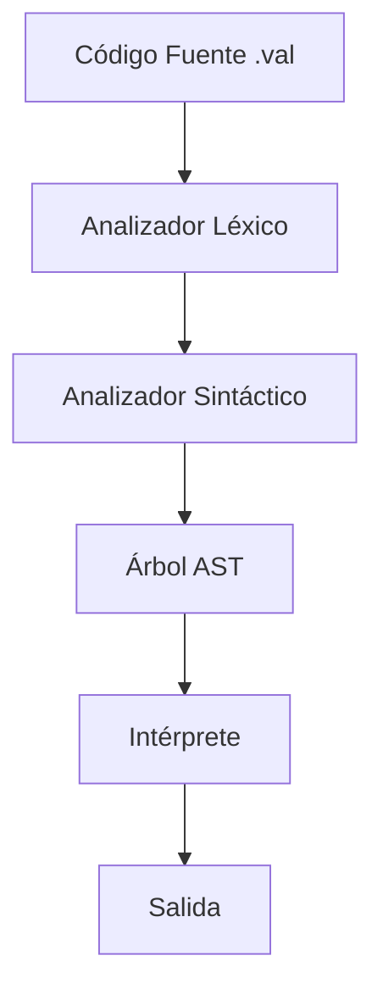

# Documentación Técnica - Compilador Valorant

## Arquitectura del Sistema

El compilador Valorant está implementado como un intérprete que ejecuta el código directamente. La arquitectura se divide en las siguientes capas:

### 1. Análisis Léxico (Flex)
- Implementado en `src/valorant.l`
- Convierte el código fuente en tokens
- Define patrones para identificadores, literales y palabras clave

### 2. Análisis Sintáctico (Bison)
- Implementado en `src/valorant.y`
- Construye el árbol de sintaxis abstracta (AST)
- Define la gramática del lenguaje

### 3. Árbol de Sintaxis Abstracta (AST)
- Implementado en `include/ast.h` y `src/ast.c`
- Representa la estructura del programa
- Facilita la interpretación del código

### 4. Intérprete
- Implementado en `include/interpreter.h` y `src/interpreter.c`
- Ejecuta el código recorriendo el AST
- Maneja el contexto de ejecución y las variables

## Diagrama de Componentes



## Tipos de Nodos AST

```c
typedef enum {
    NODE_NUMBER,      // Números literales
    NODE_STRING,      // Cadenas literales
    NODE_IDENTIFIER,  // Identificadores
    NODE_BINARY_OP,   // Operaciones binarias
    NODE_ASSIGNMENT,  // Asignaciones
    NODE_IF,          // Estructura if
    NODE_WHILE,       // Estructura while
    NODE_BLOCK,       // Bloque de código
    NODE_DECLARATION, // Declaración de variables
    NODE_INPUT,       // Entrada (breach)
    NODE_OUTPUT,      // Salida (sova)
    NODE_DEFUSE      // Break
} NodeType;
```

## Tipos de Datos

```c
typedef enum {
    TYPE_SAGE,    // int
    TYPE_VIPER,   // float
    TYPE_CYPHER   // string
} ValueType;
```

## Operadores Binarios

```c
typedef enum {
    OP_ADD,      // heal
    OP_SUB,      // damage
    OP_MUL,      // kill
    OP_DIV,      // share
    OP_WIN,      // win (mayor que)
    OP_LOSE,     // lose (menor que)
    OP_HEADSHOT, // headshot (igual)
    OP_SHARE     // share (asignación)
} BinaryOp;
```

## Estructura del Intérprete

### Contexto de Ejecución
```c
typedef struct {
    Variable* variables;
    int error_count;
    char error_message[256];
} ExecutionContext;
```

### Variables
```c
typedef struct Variable {
    char* name;
    Value value;
    struct Variable* next;
} Variable;
```

### Valores
```c
typedef struct {
    ValueType type;
    union {
        int sage_val;
        float viper_val;
        char* cypher_val;
    } value;
} Value;
```

## Proceso de Compilación

1. **Tokenización**
   - El analizador léxico identifica tokens
   - Maneja comentarios y espacios en blanco
   - Reconoce identificadores y literales

2. **Parsing**
   - Construye el AST según la gramática
   - Verifica la sintaxis del programa
   - Maneja errores sintácticos

3. **Interpretación**
   - Recorre el AST recursivamente
   - Ejecuta las operaciones
   - Maneja el contexto y las variables

## Manejo de Errores

### Errores Léxicos
- Caracteres inválidos
- Strings sin cerrar
- Números mal formados

### Errores Sintácticos
- Estructura incorrecta
- Paréntesis/llaves sin balancear
- Tokens inesperados

### Errores de Ejecución
- Variables no declaradas
- División por cero
- Tipos incompatibles
- Desbordamiento de memoria

## Extensibilidad

### Agregar Nuevos Tipos
1. Añadir al enum `ValueType`
2. Actualizar la unión en `Value`
3. Modificar las funciones de interpretación

### Agregar Nuevos Operadores
1. Añadir al enum `BinaryOp`
2. Actualizar la gramática en `valorant.y`
3. Implementar la operación en el intérprete

### Agregar Nuevas Estructuras
1. Añadir al enum `NodeType`
2. Crear funciones de creación de nodos
3. Actualizar la gramática
4. Implementar la interpretación

## Optimizaciones Futuras

1. **Evaluación Constante**
   - Evaluar expresiones constantes en tiempo de compilación
   - Reducir operaciones redundantes

2. **Manejo de Memoria**
   - Implementar un recolector de basura
   - Optimizar la asignación de memoria

3. **Caché de Variables**
   - Implementar un sistema de caché para variables frecuentes
   - Reducir búsquedas en la tabla de símbolos

4. **Paralelización**
   - Ejecutar bloques independientes en paralelo
   - Optimizar operaciones vectoriales

## Limitaciones Conocidas

1. **Funciones**
   - No hay soporte para parámetros
   - No hay recursión
   - No hay retorno de valores complejos

2. **Tipos de Datos**
   - No hay tipos compuestos
   - No hay conversión automática de tipos
   - No hay arreglos o estructuras

3. **Optimización**
   - No hay optimización de código
   - No hay análisis de flujo de datos
   - No hay eliminación de código muerto

## Guía de Contribución

1. **Estilo de Código**
   - Usar indentación consistente
   - Documentar funciones y estructuras
   - Seguir convenciones de nombres

2. **Pruebas**
   - Crear casos de prueba para nuevas características
   - Verificar regresiones
   - Documentar comportamiento esperado

3. **Documentación**
   - Actualizar la documentación técnica
   - Mantener ejemplos actualizados
   - Documentar cambios en el API 